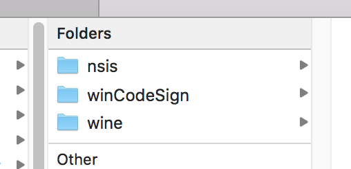
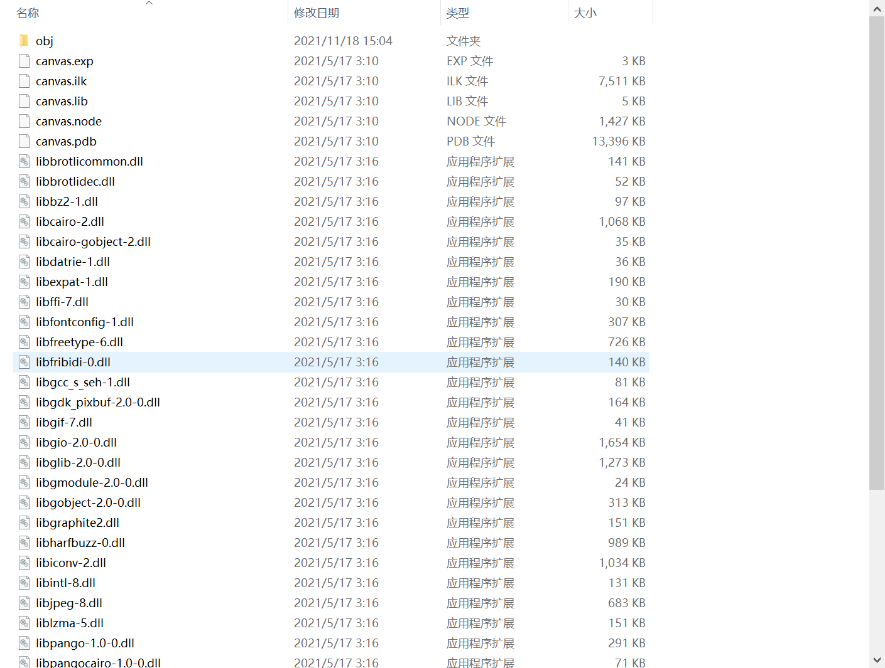

<h1>如何在 mac OS 和 Windows 下编译 Electron 应用的 node-canvas</h1>

<h2>目录</h2>

- [问题背景](#问题背景)
- [Node.js 版本](#nodejs-版本)
- [配置镜像](#配置镜像)
- [Mac OS 打包 Mac 应用](#mac-os-打包-mac-应用)
- [Mac OS 打包 Windows 应用](#mac-os-打包-windows-应用)
- [Windows 打包应用](#windows-打包应用)
- [从源码构建 node-canvas](#从源码构建-node-canvas)
- [Mac OS 安装 node-canvas 构建环境](#mac-os-安装-node-canvas-构建环境)
- [Windows 安装 node-canvas 构建环境](#windows-安装-node-canvas-构建环境)
  - [安装 node-gyp](#安装-node-gyp)
  - [安装 GTK 2](#安装-gtk-2)
  - [安装 libjpeg-turbo](#安装-libjpeg-turbo)
- [Windows 下打包时可能遇到的问题及注意项](#windows-下打包时可能遇到的问题及注意项)
  - [electron-builder 构建原生依赖时报资源 404](#electron-builder-构建原生依赖时报资源-404)
  - [errorOut=Fatal error: Unable to commit changes](#erroroutfatal-error-unable-to-commit-changes)
  - [exited with code ERR_ELECTRON_BUILDER_CANNOT_EXECUTE](#exited-with-code-err_electron_builder_cannot_execute)
  - [其他问题](#其他问题)
- [总结](#总结)
- [参考资料](#参考资料)

## 问题背景

[上一篇文章](../blog-electron-screenshot/index.html)中, 详细分析了如何使用 Electron 撸一个截屏工具, 其中, 使用到了 ndoe-canvas 模块, 由于该模块属于[原生模块](https://nodejs.org/api/addons.html), 所以在 Electron 打包构建时, 会从源码对 canvas 进行构建, 这里就需要打包操作系统具备相应的构建环境.

本文将假设开发者所处网络环境在国内, 且不具备良好的梯子条件, 从 electron 和 electron-builder 的安装开始, 分别对 Mac OS 和 Windows 下构建打包 node-canvas 应用给出解决方案.

## Node.js 版本

本文中代码运行的 Node.js 版本如下:

```
# Node    14.16.0
# NPM     6.14.11
```

## 配置镜像

首先我们需要对 node 模块的下载镜像进行代理配置, 以 Mac OS 为例, 打开当前用户的 npm 配置文件 (`~/.npmrc`), 进行如下配置:

```
# 全局注册中心地址
registry=https://registry.npm.taobao.org

# electron 镜像地址
electron_mirror=https://npm.taobao.org/mirrors/electron/

# electron_builder 镜像地址
electron_builder_binaries_mirror=https://npm.taobao.org/mirrors/electron-builder-binaries/
```

经过上述配置, 应该就能顺利安装好 electron 和 electron_builder 模块了.

## Mac OS 打包 Mac 应用

在 Mac OS 下打包 Mac 应用, 并不会遇到太多问题, 关于 node-canvas 源码构建在后边的章节详述.

## Mac OS 打包 Windows 应用

在打包 Windows 应用时, electron-builder 将从 github 上下载以下或相关类型的几个包 (依项目的构建配置而定):



由于网络原因, 这几个包的下载通常会很慢, 所以我们需要手动到构建日志中相应的地址去进行下载, 可以通过某雷等下载软件进行下载.


下载完成后, 将这几个压缩包解压到相应的目录:

```
~/Library/Caches/electron-builder/nsis/
~/Library/Caches/electron-builder/wineCodeSign/
~/Library/Caches/electron-builder/wine/
```

> 注: 不要修改解压包中的文件夹名称, 直接解压到对应目录即可.

## Windows 打包应用

由于几乎不存在使用 Windows 平台开发 Mac 应用的场景, 所以这里只讨论 Windows 应用打包.

Windows 下同 Mac OS 打包, 只是 electron-builder 构建模块的目录位置不同:

```
C:\Users\xxx\AppData\Local\electron-builder\Cache\nsis\
C:\Users\xxx\AppData\Local\electron-builder\Cache\wineCodeSign\
C:\Users\xxx\AppData\Local\electron-builder\Cache\wine\
```

## 从源码构建 node-canvas

至此, 当不存在[原生依赖模块 (native dependencies)](https://www.electronjs.org/docs/latest/tutorial/using-native-node-modules) 时, Electron 应用打包已经能够顺利进行. 

本文中, [node-canvas](https://github.com/Automattic/node-canvas) 是一个由 c++ 编写的原生模块, 所以在不同的操作系统下打包时, electron-builder 都会对原生依赖模块进行重新构建, 这里就涉及到了构建环境的安装配置. electron-builder 的打包日志见下图:


## Mac OS 安装 node-canvas 构建环境

node-canvas 是一个基于 Node.js 实现的 [Cario](https://www.cairographics.org/) Canvas 库, 而 Cario 则是由 C 语言编写的 2D 图形图像处理库.

在 Mac OS 下, 若要从源码构建 node-canvas, 需要使用 [Homebrew](https://brew.sh/) 安装以下工具:

```bash
brew install pkg-config cairo pango libpng jpeg giflib librsvg
```

安装完成后, 在打包构建时, 则能够顺利地将 node-canvas 打包进应用了.

> 注1: 这里若没有梯子, 可能安装起来也比较慢, 相较于 github 上的资源, 还是快一点. 最近 github 没有梯子真的是拿它一点办法都没有 (微软你快来大陆吧~Orz).

> 注2: 若你的 Mac OS 版本是 v10.11+, 并且在编译时遇到了某些问题, 请先确保 XCode Command Line Tools 已安装, 若未安装, 请在终端执行 `xcode-select --install` 进行安装. 同时, 若当前 XCode 的版本是 v10.0+, 则需要保证 NPM 的版本为 6.4.1 或更高.

## Windows 安装 node-canvas 构建环境

本文编写前参考并验证了各处国内的资料, 恕在下直言, 没一个能(靠)打(谱)的, 罢了, 没有当伸手党的潜质, 还是硬啃官方文档.

问:

从源码构建 node-canvas 模块, 总共分几步?

答:

1. 全局安装 node-gyp
2. 安装 GTK 2 (不是 GTK 3, 后者缺少必须的 libpng 支持)
3. 安装 libjpeg-turbo (可选, 支持 JPEG, node-canvas 2.0+)

### 安装 node-gyp

在安装 node-gyp 前, 还需要安装另外的依赖:

1. [Python](https://www.python.org/downloads/windows/)

v3.6, v3.7, v3.8, 或 v3.9, 推荐下载安装包.

2. [Visual Studio Build Tools](https://visualstudio.microsoft.com/thank-you-downloading-visual-studio/?sku=BuildTools)

启动后, 请选择安装 Visual C++ build tools 组件. 然后在终端执行以下代码进行 VS 构建工具版本配置:

```bash
npm config set msvs_version 2017
```

> 注: 若需要支持 Windows 10 ARM 架构, 还需要添加 "Visual C++ compilers and libraries for ARM64" and "Visual C++ ATL for ARM64" 组件.

3. 安装 node-gyp

```bash
npm install -g node-gyp
```

4. 配置 Python 依赖

当构建所在操作系统安装了多个版本的 Python 时, 则需要为 node-gyp 指定 Python 版本. 由于 electron-builder 构建原生模块时使用的是 npm 方式 (其他方式请参考[这里](https://github.com/nodejs/node-gyp#configuring-python-dependency)), 则需要在终端配置:

```bash
npm config set python /path/to/executable/python38.exe
```

5. 使用 node-gyp 进行构建

在终端进入 `node_modules/canvas`, 执行以下代码:

```bash
node-gyp configure
```

在执行完毕后, 在 `node_modules/canvas/build/Release` 中可以看见, 相关的图形图像处理类库, 已经被编译成了 Windows 平台下的项目文件:



### 安装 GTK 2

Cario 库打包在 GTK 中, 所以我们需要下载 GTK 2, 建议将下载的文件, 解压到固定目录 `C:\GTK` 下, 避免 node-gyp 构建时的路径问题.

[GTK 2 - 32位](http://ftp.gnome.org/pub/GNOME/binaries/win32/gtk+/2.24/gtk+-bundle_2.24.10-20120208_win32.zip)

[GTK 2 - 64位](http://ftp.gnome.org/pub/GNOME/binaries/win64/gtk+/2.22/gtk+-bundle_2.22.1-20101229_win64.zip)

### 安装 libjpeg-turbo

libjpeg-turbo 可在[官网](http://sourceforge.net/projects/libjpeg-turbo/files/)下载对应最新版本的安装文件(32位/64位), 目前的版本为 2.1.2, 安装时也建议安装在默认目录下:

```
32位: C:\libjpeg-turbo
64位: C:\libjpeg-turbo64
```

## Windows 下打包时可能遇到的问题及注意项

### electron-builder 构建原生依赖时报资源 404

即便已经能够通过手动方式, 对原生依赖进行构建, 但在默认配置下, 每次执行构建命令, electron-builder 仍然会重新对原生依赖进行构建, 此时可能会输出如下错误:

```bash
node-pre-gyp WARN Tried to download(404): https://github.com/node-gfx/node-canvas-prebuilt/releases/download/v2.6.0/canvas-v2.6.0-electron-v3.0-win32-unknown-x64.tar.gz 
node-pre-gyp WARN Pre-built binaries not found for canvas@2.6.0 and electron@3.0.11 (electron-v3.0 ABI, unknown) (falling back to source compile with node-gyp)
```

这是因为 Electron 版本的 node-canvas 没有预构建包, 而 node-pre-gyp 会默认去仓库固定格式地址下进行预构建包的下载, 所以 node-canvas 只能从源码进行构建. 所以在 Windows 上, 还需要在 `package.json` 中进行以下配置, 从而全权接管对原生模块的编译构建:

```json
// https://www.electron.build/configuration/configuration.html#configuration
// npmRebuild = true Boolean - Whether to rebuild native dependencies before starting to package the app.
{
  ...
  "build": {
    ...
    "npmRebuild": false
  }
}
```

> 注: 此时需要保证手动构建时的 Node.js 版本同 Electron 的运行环境保持一致, 这点可以通过 nvm 等 node 版本管理器来实现.

### errorOut=Fatal error: Unable to commit changes

该问题主要可能由 360电脑管家 / 腾讯电脑管家 / 杀毒软件 引起, 退出这些应用, 重新运行打包即可.

### exited with code ERR_ELECTRON_BUILDER_CANNOT_EXECUTE

在进行32位打包时, 可能会出现该错误, 将 electron-builder 版本固定为 21.2.0 即可. 

> 注, 该问题貌似只会出现在 Mac OS 上. 参考 https://github.com/electron-userland/electron-builder/issues/4629.

### 其他问题

其他可能出现的问题可参考官方 Issue: [⭐ How to Troubleshoot Installation](https://github.com/Automattic/node-canvas/issues/1511)

## 总结

Electron.js 开发在国内社区并不像 React.js 和 Vue.js 那样活跃, 但这并不意味着它没有发展空间. 在接手 IM 客户端项目的这短短半年, 其版本已经从 v13 迭代到了 v16, 可见其发展的速度之迅速, 其中也不乏大名鼎鼎的产品, 诸如 Microsoft 的 VSCode, Facebook 的 Messenger 等等. 

大前端能够做到的事情越来越多, 也降低了各平台软件的开发成本. 但坦白的说, 作为技术行业的参与者, 就必须有不断学习的觉悟和恒心.

加油!

## 参考资料

[node-gyp的作用是什么?](https://www.zhihu.com/question/36291768)

[electron 集成 addon 方案简介](https://zhuanlan.zhihu.com/p/141450682)

[处理初次使用Electron下载慢，Electron-builder打包慢的问题](https://zhuanlan.zhihu.com/p/110448415)

[[node-canvas] Installation: Windows](https://github.com/Automattic/node-canvas/wiki/Installation:-Windows)

[[node-canvas] ⭐ How to Troubleshoot Installation](https://github.com/Automattic/node-canvas/issues/1511)