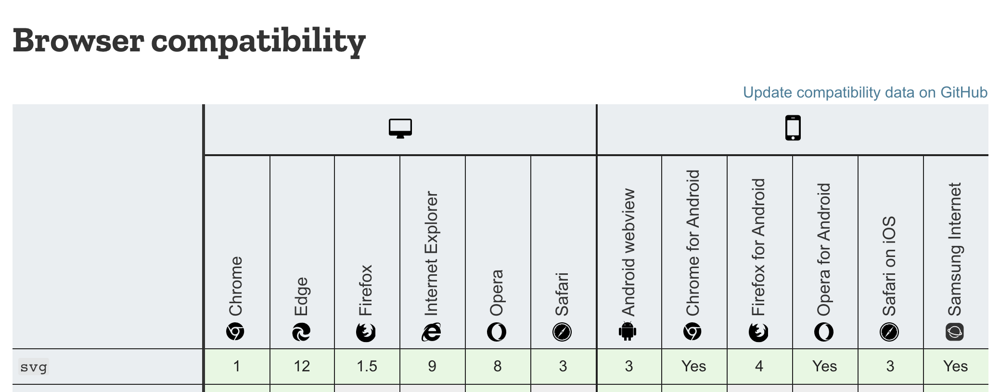

<h1>SVG Sprites 在 Vue.js 中的应用</h1>

<h2>目录</h2>

- [为什么需要使用 SVG](#为什么需要使用-svg)
- [什么是 SVG Sprites](#什么是-svg-sprites)
- [我们想要达到的目标](#我们想要达到的目标)
- [使用方法](#使用方法)
  - [安装svg-sprite-loader](#安装svg-sprite-loader)
  - [创建SVG雪碧图相关文件](#创建svg雪碧图相关文件)
  - [配置svg-sprites-loader](#配置svg-sprites-loader)
- [总结](#总结)
- [补充](#补充)
- [参考资料](#参考资料)

## 为什么需要使用 SVG

SVG, 全称Scalable Vector Graphics, 即可缩放矢量图像. 它是一种基于XML的标记语言, 用于描述基于矢量的二维图像. 它自**1999年由W3C制定**并发展, 至今已经超过了20个年头. 随着现代浏览器的不断普及, 截止本文编写之时, 全球已有94.74%的浏览器支持SVG技术(数据来源于[caniuse](https://caniuse.com/#search=SVG)). 本质上来说, SVG是一种能够用文本来描述HTML图像的标记语言.

正是有了良好的浏览器兼容性, 以及其拥有的矢量属性, 在大部分web开发项目中, 已经能够完全替代位图(即`.jpg`, `.png`等等), 成为web开发中的标准图片格式.

> 由于SVG在描述复杂图像时, 会产生大量计算, 故本文只讨论其作为图标库的场景.



截图自[MDN](https://developer.mozilla.org/en-US/docs/Web/SVG/Element/svg#Browser_compatibility).

## 什么是 SVG Sprites

顾名思义, SVG Sprites和CSS Sprites在理念上应该脱离不了干系. 我们知道, CSS Sprites是通过样式表来对一张雪碧图上的图标进行绝对定位, 从而创建出单个图标. 

同样, 对于SVG Sprites来说, 这张雪碧图则变成了若干`symbol`元素. 其原理是, **将所有的svg图标, 都使用`symbol`元素进行描述, 然后再通过使用`use`元素, 对`symbol`元素进行引用, 从而创建出相应的矢量图标**.

如果还不熟悉`symbol`与`use`的使用, 请参考以下文章:

https://developer.mozilla.org/en-US/docs/Web/SVG/Element/symbol
https://www.zhangxinxu.com/wordpress/2014/07/introduce-svg-sprite-technology/

## 我们想要达到的目标

如果需要挨个纯手工来编写SVG雪碧图, 就算对于一个小型项目来说, 都是不明智的举动. 随着项目体积的增长, 对于SVG雪碧图的维护更是天方夜谭. 那么, 有没有一种方法, 能够将这个过程完全自动化呢?

简言之, 当新的svg图标被添加进项目时, 能够自动生成相应的`symbol`元素并添加到页面上, 供`use`元素进行引用. 这样我们不用再关注如何创建`symbol`元素, 而只需要使用svg图标就可以了.

答案是肯定的, 那就是使用[svg-sprite-loader](https://github.com/JetBrains/svg-sprite-loader)加载器.

## 使用方法

> 本文中, 使用的是vue-cli工具, 所有配置都在vue.config.js文件中编写.

### 安装svg-sprite-loader

```
npm i svg-sprite-loader -D
```

### 创建SVG雪碧图相关文件

本例的目录结构如下:

```
src/assets/icons/svg      存放`.svg`图标文件
src/assets/icons/svg.js   SVG雪碧图入口文件
```

其中, 入口文件用于注册`SvgIcon`全局组件, 以及批量导入所有的`.svg`图标文件. 代码如下:

**svg.js**
```js
/**
 * svg雪碧图
 * @description 创建svg雪碧图全局组件
 * @example
 * <SvgIcon
 *  icon-class="my-icon-class"
 *  symbol-id="my-symbol-id"
 * />
 * @see {@link @/components/svg-icon/SvgIcon} 查看详细文档
 */

import Vue from 'vue';
import SvgIcon from '@/components/svg-icon/SvgIcon';

// 全局注册SvgIcon组件
Vue.component('SvgIcon', SvgIcon);

function importAll(r) {
  r.keys().forEach(r);
}

// https://webpack.js.org/guides/dependency-management/#requirecontext
const requireFuc = require.context('./svg', false, /\.svg$/);

// 导入所有`./svg`目录下的图标文件
importAll(requireFuc);
```

**SvgIcon.vue**

```html
<template>
  <svg
    :class="svgClass"
    aria-hidden="true"
    v-on="$listeners"
  >
    <use :xlink:href="svgSymbol" />
  </svg>
</template>

<script>
export default {
  name: 'SvgIcon',
  props: {
    // svg样式类名(用于自定义样式)
    iconClass: {
      type: String,
      required: false,
      default: '',
    },
    // svg元件名(即文件名)
    symbolId: {
      type: String,
      required: true,
    },
  },
  computed: {
    svgClass() {
      return this.iconClass ? `svg-icon ${this.iconClass}` : 'svg-icon';
    },
    svgSymbol() {
      // 这里的#icon前缀由svg-sprite-loader构建规则制定
      return `#icon-${this.symbolId}`;
    },
  },
};
</script>

<style scoped>
.svg-icon {
  width: 1em;
  height: 1em;
  vertical-align: -0.15em;
  fill: currentColor;
  overflow: hidden;
}
</style>
```

> 有关Webpack依赖管理的相关内容, 将再另外的文章中进行详解.

### 配置svg-sprites-loader

**vue.config.js**

```js
module.exports = {
  ...,

  chainWebpack: (config) => {
    ...,

    // #region 配置svg
    // 用作图片(这里覆盖了内置的svg规则, 注释部分为vue-cli默认配置)
    config.module
      .rule('svg')
      // .test(/\.svg$/)
      .exclude.add(resolve('src/assets/icons/svg'));
      // .end()
      // .use('file-loader')
      // .loader('file-loader')
      // .options({
      //   name: `${assetsPath}/img/[name].[hash:8].[ext]`,
      // });
    // 用作图标
    config.module
      .rule('svg-icon')
      .test(/\.svg$/)
      .include.add(resolve('src/assets/icons/svg'))
      .end()
      .use('svg-sprite-loader')
      .loader('svg-sprite-loader')
      .options({
        symbolId: 'icon-[name]',
      });
    // #endregion
  },
```

## 总结

通过编写上面的代码, 同时结合svg-sprite-loader, 就完成了SVG雪碧图在Vue.js中的实现.

在实际项目开发中, 我们只需要将新的svg图标放入指定的目录中(这里是src/assets/icons/svg), 就可以通过`SvgIcon`组件进行使用, 而不需要再做其他的工作, 极大地提高了开发效率. 

同时svg图标是矢量图标, 缩放不失真, 且样式可控. 一句话, 爽歪歪谁用谁知道.

## 补充

相比起字体图标, svg雪碧图有着兼容性的优势, 以及样式上更佳的灵活性. 同时由于`symbol`元素是本地创建并插入到HTML文档中, 拥有更快的加载速度. 在后期维护中, svg雪碧图不用频繁地对字体图标资源进行更新, 而仅仅需要新增图标文件即可, 这些都是字体图标所不具备的优点.

## 参考资料

[懒人神器：svg-sprite-loader实现自己的Icon组件](https://segmentfault.com/a/1190000015367490)

[vue 使用svg图片 svg-sprite-loader](https://juejin.im/post/5c693d3af265da2dc231d7ea)
